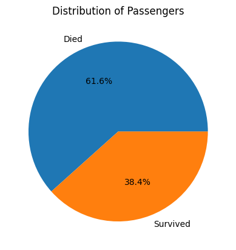
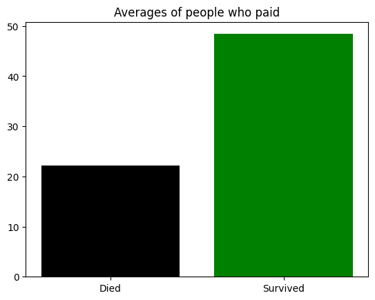
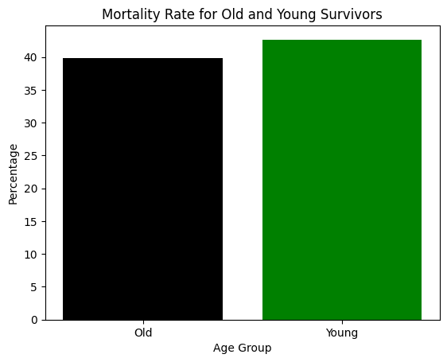

# Exploring the Titanic Dataset


## **Introdcution**

The Titanic is one of the most recognizable tragedies to ever happen. On its voyage, the RMS Titanic, a British passenger ship, struck an iceberg, resulting in a terrible tragedy that has been talked about ever since. There was a great deal of loss in the tragic event and it left an indelible mark on history. In this blog, we will delve into the Titanic dataset to uncover insights and answer  questions about the passengers on board this voyage.


## **The Data**

``This is a example of the type of data I had worked with throughout this whole project:``


| PassengerId | Survived | Pclass | Name                 | Sex  | Age | SibSp | Parch | Ticket | Fare | Cabin | Embarked |
|------------|----------|--------|----------------------|------|-----|-------|-------|--------|------|-------|----------|
| 22         | 1        | 2      | Beesley, Mr. Lawrence | male | 34  | 0     | 0     | 248698 | 13   | D56   | S        |

## **Question 1: What is the percentage of people who had survived?**

To answer our first question, we want to find out the percentage of passengers who survived the disaster. We will visualize this data to make it more understandable.

```python
import pandas as pd
import matplotlib.pyplot as plt

df = pd.read_csv("titanic.csv")

died = df[df['Survived'] == 0]
survived = df[df['Survived'] == 1]

died_count = died.shape[0]
survived_count = survived.shape[0]
labels = ['Died', 'Survived']
sizes = [died_count, survived_count]

plt.pie(sizes, labels=labels, autopct='%1.1f%%')
plt.title('Distribution of Passengers')
plt.show()
```


This graph is a pie chart that visually represents the distribution of passengers who survived and those who did not. It provides a clear visualization of the proportion of survivors and non-survivors among the Titanic passengers.

## **Question 2: What is the average fare of everyone who paid and died, versus the average fare of everyone who paid and was alive on the Titanic dataset?**

In our second question, we want to compare the average fare paid by passengers who survived and those who did not. This will help us understand if fare had any influence on survival.

```python
import pandas as pd
import matplotlib.pyplot as plt

df = pd.read_csv("titanic.csv")

died = df[df['Survived'] == 0]['Fare'].mean()
survived = df[df['Survived'] == 1]['Fare'].mean()
died = round(died, 2)
survived = round(survived, 2)

print('The mean fare for passengers who paid and died was', died)
print('The mean fare for passengers who paid and survived was', survived)

label = 'Died', 'Survived'
ylist = [died, survived]
plt.title('Averages of people who paid')
plt.bar(label, ylist, color=['black', 'green'])
plt.show()
```


This graph is a bar chart that compares the average fare paid by passengers who survived with the average fare paid by passengers who did not survive. It allows us to see the difference in fare between these two groups.

## **Question 3: What is the percentage of people 21 and under who survived, as opposed to the people over 21?**

In our third question, we aim to explore the difference in survival rates between passengers aged 21 and under and those over 21.

```python
import pandas as pd
import matplotlib.pyplot as plt

df = pd.read_csv("titanic.csv")

young = df[df['Age'] <= 21]
old = df[df['Age'] > 21]

avg_young = young['Survived'].mean() * 100
avg_old = old['Survived'].mean() * 100

labely = (avg_old, avg_young)
labelx = 'Old', 'Young'

plt.bar(labelx, labely, color=['black', 'green'])
plt.xlabel('Age Group')
plt.ylabel('Percentage')
plt.title('Mortality Rate for Old and Young Survivors')
plt.show()

```


This graph is a bar chart that illustrates the difference in the percentage of survivors between two age groups: those aged 21 and under (Young) and those above 21 (Old). It provides a visual comparison of the survival rates for these two distinct age groups.
##

# Conclusion

Exploring the Titanic dataset has allowed myself to gain valuable insights into the demographics and circumstances of the passengers. Important questions have been answered, such as survival percentages, average fares, and the difference in survival rate based upon age. This dataset serves to be a reminder of the tragic event of the Titanic.


If you'd like to view the full code that generated these graphs, you can find it [here](https://github.com/KaiSteamCenter/Unit2-Python/blob/main/titanicDataset.ipynb).